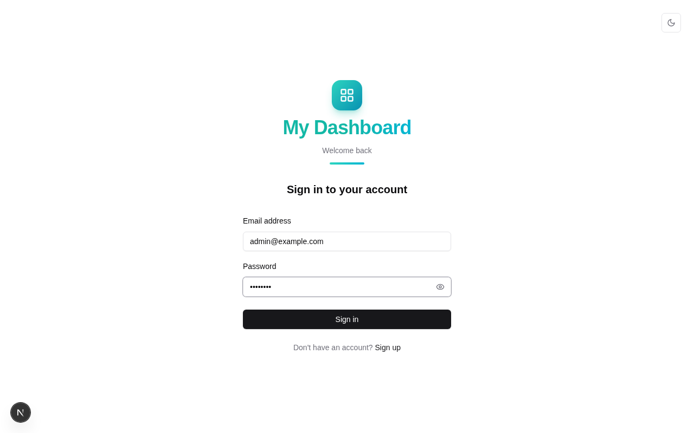
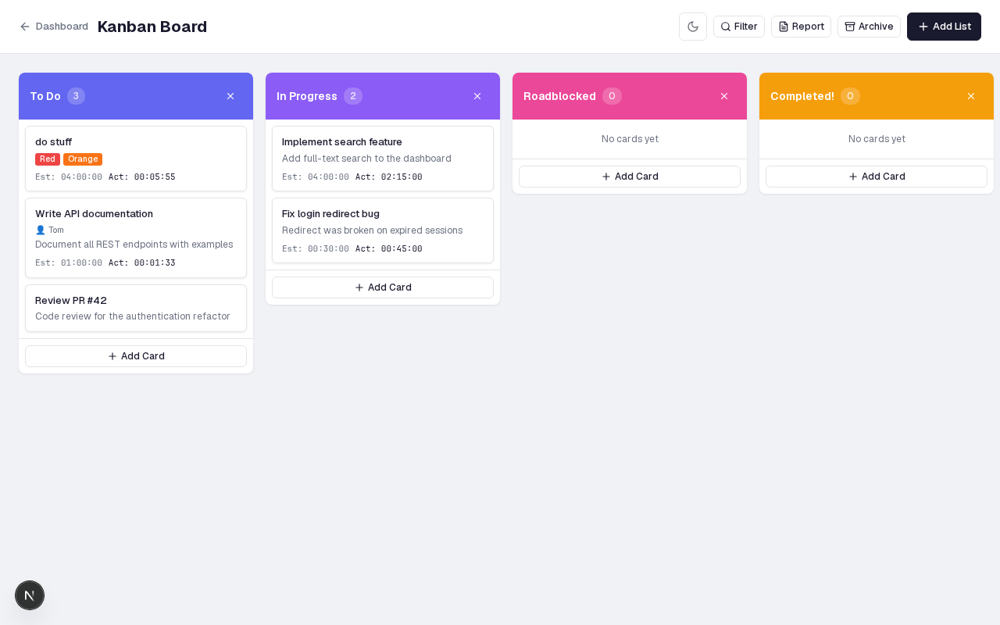
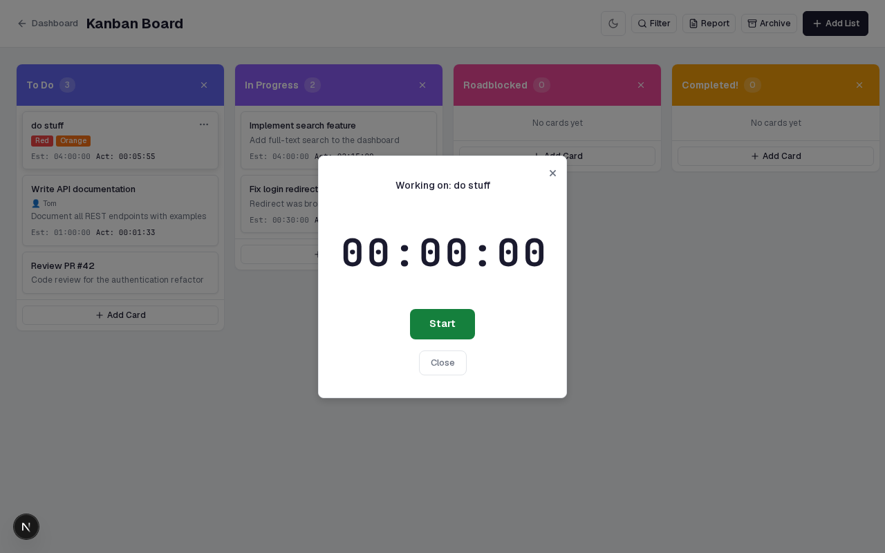

# my-dashboard

An app-launcher dashboard with authentication. Built with Next.js 15 (App
Router), TypeScript, Node.js's built-in `node:sqlite` (raw SQL, no ORM), and
shadcn/ui.
Users sign up or are provisioned by an admin, then see a launcher grid of
applications. Admins manage users and apps; access control is a **denylist**
plus an **admin-only** flag — every enabled, non-admin-only app is granted
to every user, admins block apps per user, and admin-only apps are hidden
from every non-admin user. Admins always see and can launch all enabled
apps. Every user (and admin) also owns a personal SQLite database
(`user-data/<username>.db`) that the dashboard's applications use — it is
created on login and self-healed on every authenticated request.

## Tech stack

- **Framework**: Next.js 15.5 (App Router, Turbopack dev)
- **Language**: TypeScript
- **Database**: SQLite via Node.js's built-in `node:sqlite` module, raw SQL — `db/schema.sql` is the contract
- **Auth**: JWT (jose, 24 h) in an HTTP-only `auth-token` cookie; bcryptjs password hashing
- **Validation**: zod
- **UI**: Tailwind CSS v3 + shadcn/ui (new-york style, zinc, class-based dark mode)

## Screenshots

| Sign-in | Kanban Board | Task Timer |
|---------|-------------|------------|
|  |  |  |

The **sign-in** page accepts email and password (with a link to sign-up). The **kanban board** supports drag-and-drop, labels, assignees, time estimates, search/filter, and archiving. The **task timer** tracks work sessions with start/pause, 15-second heartbeats, and duration summaries.

## Getting started

### Prerequisites

- Node.js 24+ (the built-in `node:sqlite` module is stable from v24)
- `sqlite3` CLI (optional, for poking at the DB)

### Setup

```bash
npm install
cp .env.local.example .env.local
# edit .env.local:
#   JWT_SECRET   →  openssl rand -base64 32
#   ADMIN_EMAIL / ADMIN_PASSWORD → first-run admin
npm run setup
npm run dev   # http://localhost:3000
```

`npm run setup` runs `db:init` (applies `db/schema.sql`, idempotent) then
`db:seed` (creates the admin from `ADMIN_EMAIL`/`ADMIN_PASSWORD` **if no
admin exists**, and inserts the Projects / Analytics / Reports placeholder
apps **if no apps exist**).

Sign in at `/sign-in` with the admin credentials. Public sign-up at
`/sign-up` always creates `role: user` accounts, which start with access to
all enabled apps — including the built-in **Kanban** board tile.

## Scripts

| Script            | Purpose                                              |
| ----------------- | ---------------------------------------------------- |
| `npm run dev`     | Dev server (Turbopack)                               |
| `npm run build`   | Production build                                     |
| `npm run start`   | Serve the production build                           |
| `npm run lint`    | ESLint                                               |
| `npm run db:init` | Create tables from `db/schema.sql` (idempotent)      |
| `npm run db:seed` | Seed first admin + placeholder apps (no-op if exist) |
| `npm run setup`   | `db:init && db:seed`                                 |

## API

All routes run on the `nodejs` runtime, validate with zod, and return
`{ error, errorType?, errors? }` on failure.

### Auth

| Method | Path              | Description                                                        |
| ------ | ----------------- | ------------------------------------------------------------------ |
| POST   | `/api/auth/sign-up` | Public registration `{ name, username, email, password }` → `role: user`, auto sign-in (cookie). `409 { errorType: 'username_taken' }` on username conflict |
| POST   | `/api/auth/sign-in` | Sign in. Disabled account → `403 { errorType: 'disabled' }`. Ensures the user's personal DB exists      |
| POST   | `/api/auth/logout`  | Clear the session cookie                                          |
| GET    | `/api/auth/me`      | `{ user, apps }` — apps the user can access (admins: all enabled, incl. admin-only; users: enabled − admin-only − denylist) |

### Admin

All admin routes re-check the DB on every call (role **and** disabled
status — demotions and disables apply immediately).

| Method | Path                                | Description                                                        |
| ------ | ----------------------------------- | ------------------------------------------------------------------ |
| GET    | `/api/admin/users`                  | All users, each with `appCount` and `blockedAppIds`                |
| POST   | `/api/admin/users`                  | Create user `{ name, username, email, password, role }` — `409 { errorType: 'username_taken' }` on conflict |
| PATCH  | `/api/admin/users/:id`              | Edit user `{ name?, username?, email?, role?, disabled? }` (never the password) — `409` on self-disable, self-demote, last active admin, or username/email conflict. Renaming the username moves their personal data file |
| DELETE | `/api/admin/users/:id`              | Delete user, their permission rows, and their personal DB — `409` on self or last active admin |
| POST   | `/api/admin/users/:id/password`     | `{ password }` — set the user's password to a specified value (same policy as sign-up) |
| PUT    | `/api/admin/users/:id/permissions`  | `{ blockedAppIds: number[] }` — replaces the user's denylist       |
| GET    | `/api/admin/apps`                   | All apps (including disabled), each with `adminOnly`                |
| POST   | `/api/admin/apps`                   | Create app `{ name, url, icon, adminOnly? }` — slug auto-kebab-cased, `409` on dup |
| PATCH  | `/api/admin/apps/:id`               | `{ name?, url?, icon?, enabled?, adminOnly? }` — renaming recomputes the slug |

### Kanban

The built-in Kanban board is a first-class dashboard app mounted at `/kanban`.
It uses the same auth model as the rest of the project: edge middleware gates
page access, and every `/api/kanban*` route re-checks the session user in the
DB on every request.

| Method | Path                           | Description |
| ------ | ------------------------------ | ----------- |
| GET    | `/api/kanban`                  | `{ lists }` — full board for the current session user |
| POST   | `/api/kanban/lists`            | `{ title }` → create a list |
| PUT    | `/api/kanban/lists/:id`        | `{ title }` → rename a list |
| DELETE | `/api/kanban/lists/:id`        | Delete a list and its cards |
| POST   | `/api/kanban/cards`            | `{ listId, title, description? }` → create a card |
| PUT    | `/api/kanban/cards/:id`        | `{ title?, description? }` → update a card |
| DELETE | `/api/kanban/cards/:id`        | Delete a card |
| POST   | `/api/kanban/cards/:id/move`   | `{ targetListId, position }` → move a card |

## Design decisions

### Permissions: denylist (default-allow) + admin-only apps

A row in `user_applications` means the user **cannot** access that app.
Accessible apps, per role:

- **admins** — every enabled app, including `admin_only` ones. The denylist
  does not apply to admins.
- **users** — enabled apps minus `admin_only` apps (hidden by role) minus
  the user's denylist rows.

Consequences:

- New non-admin-only apps are auto-granted to every user — no permission seeding.
- New users need no permission rows at all.
- "Restore default access" is just deleting rows.
- Admin-only apps are locked in the per-user permissions dialog: always
  shown for admins, always hidden for users. The permissions API normalizes
  stored denylists accordingly (drops admin-only ids for users, clears the
  list for admins), so stored state always matches effective access.

### Disable semantics (live-session kill)

`users.disabled` blocks both new sign-ins and live sessions:

- Sign-in for a disabled account → `403 { errorType: 'disabled' }`, checked
  before the password comparison.
- Every authenticated API request re-checks the DB
  (`getSessionUser()` → `getUserById` → `null` when missing or disabled).
  That re-check — not the 24 h JWT — is what revokes live sessions
  immediately. It is also what makes a **deleted** user's live sessions die
  instantly (the `getUserById` lookup returns null for a gone row).
- Guards: an admin cannot disable or demote their own account, and the last
  active admin cannot be disabled or demoted. Deletion is guarded the same
  way: an admin cannot delete themselves, and the last active admin cannot
  be deleted. All return `409`.

### Editing, deleting, and setting passwords

- **Edit** (`PATCH /api/admin/users/:id`) updates `name`, `username`,
  `email`, `role`, and/or `disabled` — never the password. Username and
  email are checked for uniqueness against *other* users (`409` on
  `username_taken` / `email_taken`). Changing the username moves the user's
  personal data file `user-data/<username>.db` to the new name so their apps
  keep working (best-effort; skipped if the target name already exists).
- **Delete** (`DELETE /api/admin/users/:id`) removes the user. Their
  `user_applications` rows cascade (foreign keys), and their personal DB
  file is removed. Live sessions are killed immediately by the per-request
  DB re-check.
- **Set password** (`POST /api/admin/users/:id/password`) overwrites a user's
  password with a specified value, validated by the same policy as sign-up
  and hashed with bcrypt. It works for any account, including the admin's
  own (there is no self-service password-change flow). Existing live
  sessions are **kept** — the JWT is id-based, not password-based — so the
  new password takes effect at the user's next sign-in.

### Edge vs Node split of auth checks

- `src/middleware.ts` runs at the edge (no DB access) and gates on the JWT
  only: `/dashboard*` requires a valid token; `/admin*` additionally requires
  `payload.role === 'admin'` (which is why `role` is embedded in the token);
  `/sign-in` and `/sign-up` redirect authenticated visitors to `/dashboard`.
- API routes are authoritative: they re-check the DB on every request, so a
  demotion/disable takes effect immediately. The edge gate is only a fast
  redirect for page navigation.

### CORS

Same-origin by default — no CORS headers are emitted. When `ALLOWED_ORIGINS`
(comma list) is set, matching origins get
`Access-Control-Allow-Origin: <origin>` + `Access-Control-Allow-Credentials:
true` + `Vary: Origin`, and every API route answers OPTIONS preflights with
`204`.

### Per-user databases

Each user (including admins) owns a personal SQLite file at
`USER_DATA_DIR/<username>.db` (default `./user-data/`, gitignored).
User and app **maintenance** — i.e. everything in the central dashboard DB
(users, applications, permissions) — stays on `dashboard.db`; every other
application on the dashboard uses the user's own DB.

Today the shipped Kanban app stores its board in that file via namespaced
`kanban_lists` and `kanban_cards` tables, so each user gets a strictly private
board with no cross-user API surface.

- **Filename = `username`**, a unique, filesystem-safe identifier (2–32
  chars: `[a-zA-Z0-9._-]`, must start with a letter or digit). Sign-up and
  admin user creation validate it; pre-existing users had theirs derived
  from the email local part by a self-healing migration
  (`john.doe@example.com` → `john.doe`, deduped with `-2`, `-3`, …).
- **Creation**: on sign-in and sign-up, and lazily re-ensured whenever a
  session is resolved (`getSessionUser()`) — a single `stat` when the file
  already exists, so old sessions or a deleted file heal without a re-login.
  The file is created empty (WAL journaling, so several apps can share it
  concurrently); each application manages its own tables.
- Creation is best-effort: a failure is logged and never blocks login or an
  API request.

### Kanban board app

- The launcher seed now idempotently ensures an enabled `Kanban` app row with
  slug `kanban`, icon `kanban`, and url `/kanban`, so it appears for all users
  by default.
- `/kanban` is a faithful React 19 port of OpenKanban's dual-mode UI:
  standard human mode uses drag-and-drop and hover menus, while
  `?agent=true` (or `?mode=agent`) switches to large controls, always-visible
  forms, and explicit move dropdowns for browser agents.
- The board CSS is scoped under `.kanban-root`, including its reset, so the
  imported OpenKanban styling cannot leak into the surrounding dashboard.
- A 5-minute `/api/auth/me` heartbeat keeps an idle-open kanban tab aligned
  with the dashboard's sliding-session behavior.

### Storage

SQLite via Node.js's built-in `node:sqlite` (`DatabaseSync`, WAL mode,
`PRAGMA foreign_keys=ON`). Two layers:

- **Central**: `DATABASE_PATH` (default `./data/dashboard.db`, gitignored) —
  users, applications, permissions. The schema lives in plain SQL
  (`db/schema.sql`); `db:init` runs it idempotently
  (`CREATE ... IF NOT EXISTS`), and `getDb()` applies small self-healing
  migrations for databases created before a column existed. No ORM, no
  migration tool.
- **Per-user**: `USER_DATA_DIR/<username>.db` (default `./user-data/`,
  gitignored) — see [Per-user databases](#per-user-databases).

## Project structure

```
db/schema.sql                # plain-SQL schema contract
scripts/init-db.mjs          # applies the schema (idempotent)
scripts/seed.mjs             # first-run admin + placeholder apps
src/lib/db.ts                # raw node:sqlite helpers (users, apps, denylist)
src/lib/user-db.ts           # per-user SQLite DBs (user-data/<username>.db)
src/lib/auth.ts              # JWT, cookie session, getSessionUser, requireAdmin
src/lib/cors.ts              # same-origin default / ALLOWED_ORIGINS preflight
src/lib/validations.ts       # zod schemas
src/middleware.ts            # edge gate (JWT only): /dashboard, /admin, sign-in/up
src/components/ui/           # shadcn/ui primitives
src/components/admin-shell.tsx  # shared chrome for /admin* pages
src/components/app-icon.tsx     # fixed lucide icon set + fallback
src/components/kanban/        # kanban React port (hooks, components, scoped CSS)
src/app/dashboard/            # user launcher grid (+ Admin tile for admins)
src/app/kanban/               # kanban page wrapper
src/app/admin/                # function launcher, user mgmt, app mgmt
src/app/api/auth/             # sign-up, sign-in, logout, me
src/app/api/admin/{users,apps}/   # admin API
src/app/api/kanban/           # per-user kanban API
src/lib/kanban.ts             # per-user kanban SQLite layer
```
